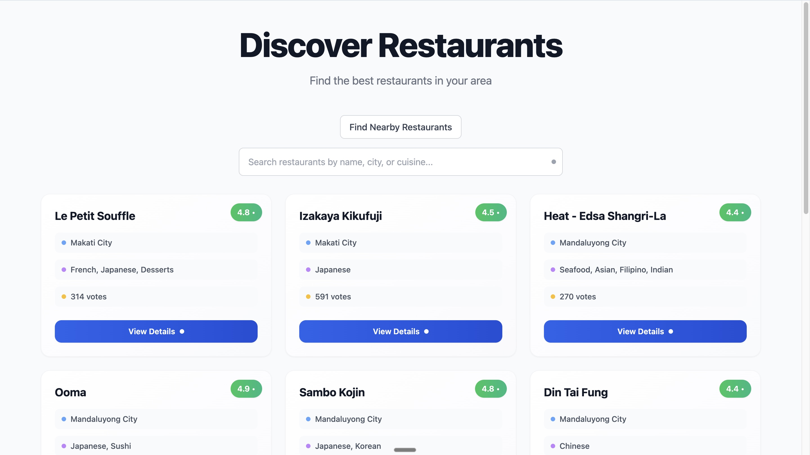
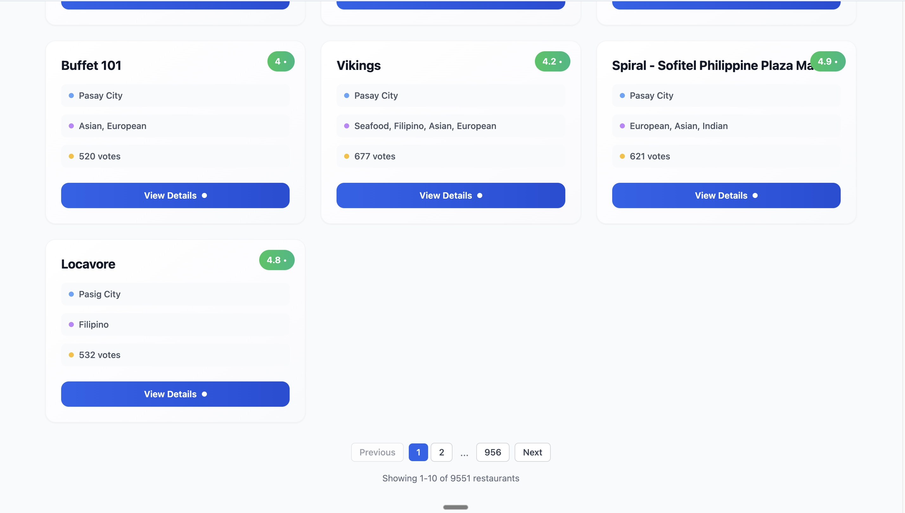
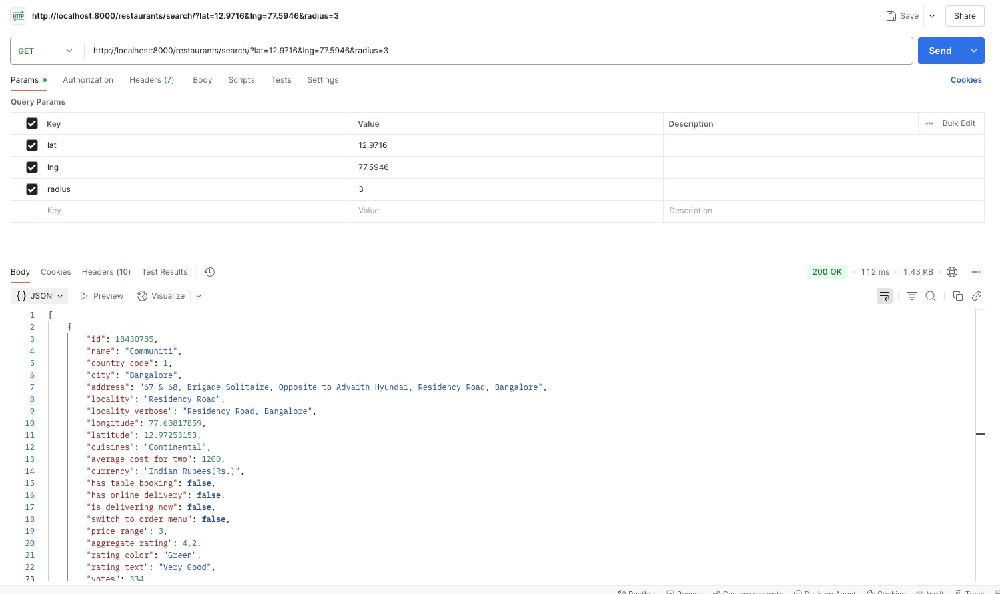
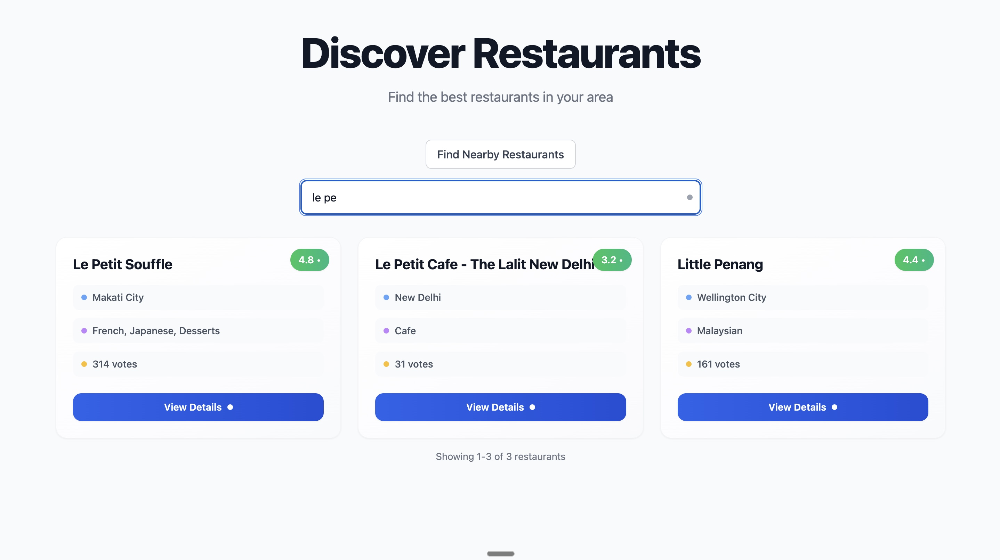
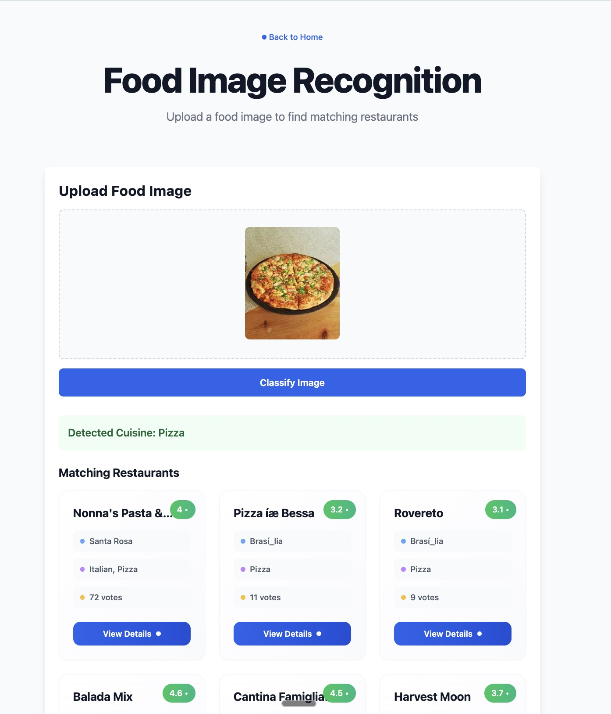

# 🍽️ Zomato Restaurant Listing & Search App

A full-stack web app to explore Zomato-style restaurant data, with search by location, cuisine, and even food image uploads.

---

## 🚀 Features

- 🔍 Search & view restaurants
  - By ID
  - List view with pagination
- 📍 Search by location (restaurants near a lat/lng within 3km)
- 📸 Image-based cuisine search — upload a food photo to find matching restaurants
- 🧱 Filters by cuisine, country, and average cost
- 🖼️ Clean React + TypeScript frontend with routing

---

## 🛠️ Tech Stack

- Backend: Django + Django REST Framework
- Frontend: React + TypeScript + Vite
- Image Classification: PyTorch + ResNet18 (ImageNet)

---

## ⚙️ Setup Instructions

### 1. Backend

Make sure you have Python 3.9+ and pip.

```bash
cd backend
python -m venv env
source env/bin/activate   # On Windows: env\Scripts\activate
pip install -r requirements.txt
```

Create a .env or set up your DB config as needed (uses SQLite by default).

Run migrations and load sample data:

```bash
python manage.py migrate
python manage.py runserver
```

(Optional) Load your restaurants CSV:

```bash
python manage.py load_data
```

API will be running at: http://localhost:8000

### 2. Frontend

```bash
cd frontend
npm install
npm run dev
```

Frontend will be on: http://localhost:5173

---

## 🥪 API Endpoints

| Endpoint             | Method | Description                                   |
| -------------------- | ------ | --------------------------------------------- |
| /restaurants/        | GET    | List restaurants (with pagination)            |
| /restaurants/{id}/   | GET    | Get a single restaurant by ID                 |
| /restaurants/search/ | GET    | Get restaurants within 3km of lat/lng         |
| /classify-image/     | POST   | Upload food image → get cuisine + restaurants |

---

## 🖼️ Image Cuisine Search

You can upload a food photo (e.g. pasta.jpg), and the backend will:

- Run ResNet18 model to classify it (using ImageNet)
- Match keyword to a cuisine
- Return restaurants with matching cuisine

Accuracy is basic but suitable for demo purposes.

---

## ✨ Example Usage

Frontend will allow:

- Browsing restaurants
- Searching by keyword or location
- Uploading food images to search

Backend is modular — you can test via Postman or curl:

```bash
curl -X POST -F "image=@icecream.jpg" http://localhost:8000/classify-image/
```

---

## 📸 Screenshots

### Home Page



### Restaurant List with Pagination



### Distance-based Search



### Filtering Options



### Image Recognition for Cuisine Search



---

## 🧐 Optional Enhancements

- Use Google Vision API for better cuisine detection
- Add authentication, user favorites
- Add filters & sort in frontend
- Add map view (e.g. Leaflet or Google Maps)

---

## 📝 License
